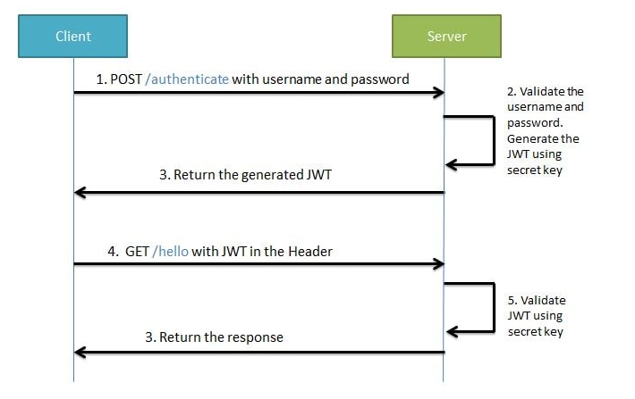
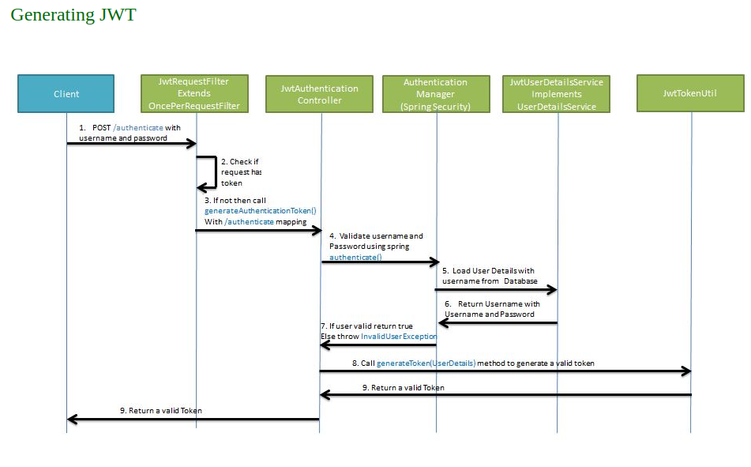
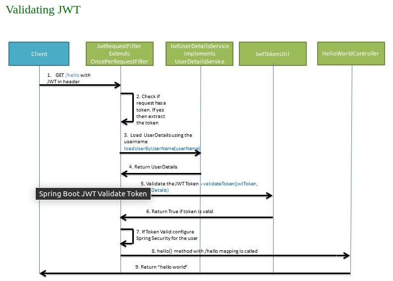

### 1. How to lazy join in Hibernate

There is a One-Many relationship between the `Customer` and `Invoice` entity classes. A customer can have many invoices.

`Customer` entity class

```java
package com.jeremy.fundamentals.entities;

import lombok.Getter;
import lombok.Setter;

import javax.persistence.*;
import java.io.Serializable;

@Entity
@Table(name = "customers")
@Getter
@Setter
public class Customer implements Serializable {
    @Id
    @GeneratedValue(strategy = GenerationType.IDENTITY) // for `serial` type in postgres
    @Column(name="id")
    private Integer Id;

    @Column(name = "name", nullable = false)
    private String Name;
}

```

And `Invoice` entity class

```java
package com.jeremy.fundamentals.entities;

import lombok.Getter;
import lombok.Setter;

import javax.persistence.*;
import java.io.Serializable;
import java.util.Date;

@Entity
@Table(name = "invoices")
@Getter
@Setter
public class Invoice implements Serializable {
    @Id
    @Column(name="stockcode", nullable = false)
    private String StockCode;

    @Column(name="quantity", nullable = false)
    private int Quantity;

    @Column(name="invoicedate", nullable = false)
    private Date InvoiceDate;

    @Column(name="unitprice", nullable = false)
    private Double UnitPrice;

    // must hide this if you defined a navigation property with JoinColumn
    // org.hibernate.MappingException: Repeated column in mapping for entity: com.jeremy.fundamentals.entities.Invoice column: customerid
    // @Column(name="customerid", nullable = false)
    // private int CustomerId;

    @Column(name="country", nullable = false)
    private String Country;

    @ManyToOne(fetch = FetchType.LAZY)
    @JoinColumn(name = "customerid")
    private Customer Customer;
}

```

Note:

1. When creates the navigation property `customer` with JoinColumn `customerid`, needs to hide the original `private int CustomerId`. Otherwise will get error `org.hibernate.MappingException: Repeated column in mapping for entity: com.jeremy.fundamentals.entities.Invoice column: customerid`.
2. fetch Type can be set to `Eager`. But it it not optimized for performance.

And in order to work with `LAZY`, the most easiest way is `join fetch`. see below example.

```java
package com.jeremy.fundamentals.services;

import com.jeremy.fundamentals.entities.Invoice;
import com.jeremy.fundamentals.repositories.InvoiceRepository;
import org.springframework.beans.factory.annotation.Autowired;
import org.springframework.stereotype.Service;

import javax.persistence.EntityManager;
import javax.persistence.PersistenceContext;
import javax.persistence.TypedQuery;
import java.util.Optional;

@Service
public class InvoiceService implements IInvoiceService{
    @PersistenceContext
    EntityManager em;

    @Autowired
    private InvoiceRepository invoiceRepository;

    @Override
    public Optional<Invoice> findById(String id) {

        return invoiceRepository.findById(id);
    }

    public Iterable<Invoice> findAllById(String stockCode) {
    // in below query, the i.Customer and i.StockCode are property names of the Invoice class
    TypedQuery<Invoice> query = em.createQuery("Select i from Invoice i join fetch i.Customer where i.StockCode = :stockcode", Invoice.class)
            .setParameter("stockcode", stockCode);
    return query.getResultList();
}
}

```

If you don't use `join fetch`, will get below error `org.hibernate.LazyInitializationException: could not initialize proxy - XXX -no Session`.

The reason is well explained in this article [Fix LazyInitializationException: could not initialize proxy Error](could_not_initialize_proxy_Error.md)

If you are using Criteria then the same method can be written as given below-

```java
public Iterable<Invoice> findAllById(String stockCode) {
    CriteriaBuilder cb = em.getCriteriaBuilder();
    CriteriaQuery<Invoice> cq = cb.createQuery(Invoice.class);
    Root<Invoice> invoiceRoot = cq.from(Invoice.class);
    invoiceRoot.fetch("Customer"); // the `Customer` navigation property on Invoice entity class

    Predicate stockCodePredicate = cb.equal(invoiceRoot.get("StockCode"), stockCode);
    cq.where(stockCodePredicate);

    TypedQuery<Invoice> query = em.createQuery(cq);
    return query.getResultList();
}
```

Note:

1. The standard 'join' doesn't work with LAZY.

Below join does NOT work. Will throw same error as before. `Caused by: org.hibernate.LazyInitializationException: could not initialize proxy [com.jeremy.fundamentals.entities.Customer#14735] - no Session`

```java
 public Iterable<Invoice> findAllById(String stockCode) {
    CriteriaBuilder cb = em.getCriteriaBuilder();
    CriteriaQuery<Invoice> cq = cb.createQuery(Invoice.class);
    Root<Invoice> invoiceRoot = cq.from(Invoice.class);

    Predicate stockCodePredicate = cb.equal(invoiceRoot.get("StockCode"), stockCode);

    Join<Invoice, Customer> bJoin= invoiceRoot.join("Customer", JoinType.LEFT);
    bJoin.on(stockCodePredicate);

    TypedQuery<Invoice> query = em.createQuery(cq);
    return query.getResultList();
}
```

### 2. Validation in Spring Boot

[Validation with Spring Boot - the Complete Guide](https://reflectoring.io/bean-validation-with-spring-boot/)

1. Firstly annotate the input dto class

```java
package com.jeremy.fundamentals.dtos;

import com.jeremy.fundamentals.validators.IpAddress;
import lombok.Getter;
import lombok.Setter;

import javax.validation.constraints.NotBlank;
import javax.validation.constraints.NotNull;
import javax.validation.constraints.Pattern;

@Getter
@Setter
public class UpsertUserInput {
    @NotNull(message = "Name is mandatory")
    @NotBlank(message = "Name is mandatory")
    @Pattern(regexp = "^[a-zA-Z]+(([',. -][a-zA-Z ])?[a-zA-Z]*)*$", message = "Invalid Name Format")
    private String name;
}
```

2. Then set up the @Valid annotation to the input dto object. And optionally, you can add a custom error handler for this controller class

```java
package com.jeremy.fundamentals.controller;

import com.jeremy.fundamentals.FundamentalsApplication;
import com.jeremy.fundamentals.dtos.UpsertUserInput;
import com.jeremy.fundamentals.entities.Customer;
import com.jeremy.fundamentals.services.UserService;
import org.apache.logging.log4j.message.FormattedMessage;
import org.slf4j.Logger;
import org.slf4j.LoggerFactory;
import org.springframework.beans.factory.annotation.Autowired;
import org.springframework.http.HttpStatus;
import org.springframework.http.MediaType;
import org.springframework.http.ResponseEntity;
import org.springframework.web.bind.MethodArgumentNotValidException;
import org.springframework.web.bind.annotation.*;

import javax.validation.Valid;

import static org.springframework.http.ResponseEntity.ok;

@RestController
@RequestMapping("users") // localhost:8080/users
public class UserController {

    private static final Logger log = LoggerFactory.getLogger(FundamentalsApplication.class);

    @Autowired
    private UserService _userService;

   // 'Get' Method omitted

    @PostMapping
    public ResponseEntity<Customer> createUser(@Valid @RequestBody UpsertUserInput customer) {
        return new ResponseEntity<Customer>(_userService.createUser(customer), HttpStatus.CREATED);
    }

    @PutMapping(value = "{id}")
    public ResponseEntity updateUser(@PathVariable int id, @Valid @RequestBody UpsertUserInput customer) {
        var isUpdated = _userService.updateUser(id, customer);

        if (!isUpdated) {
            return new ResponseEntity<>(HttpStatus.NOT_FOUND);
        }

        return new ResponseEntity<>(HttpStatus.NO_CONTENT);
    }

    // 'Delete' Method omitted

    @ExceptionHandler(MethodArgumentNotValidException.class)
    @ResponseStatus(HttpStatus.BAD_REQUEST)
    ResponseEntity<String> handleMethodArgumentNotValidExceptionException(MethodArgumentNotValidException e) {
        StringBuilder sb = new StringBuilder();
        for (var error : e.getAllErrors()) {
            FormattedMessage fm = new FormattedMessage("{0}: {1}.", error.getObjectName(), error.getDefaultMessage());
            sb.append(fm);
        }
        return new ResponseEntity<>("Validation error(s): " + sb.toString(), HttpStatus.BAD_REQUEST);
    }
}

```

An example of response with errors:

```
Validation error(s): upsertUserInput: Invalid Name Format.
```

### How to add custom validator

[Validation with Spring Boot - the Complete Guide](https://reflectoring.io/bean-validation-with-spring-boot/)

Step 1: Create a @interface. The @ symbol denotes an annotation type definition. That means it is not really an interface, but rather a new annotation type to be used as a function modifier, such as @override.

```java
package com.jeremy.fundamentals.validators;

import javax.validation.Constraint;
import javax.validation.Payload;

import java.lang.annotation.Documented;
import java.lang.annotation.Retention;
import java.lang.annotation.Target;

import static java.lang.annotation.ElementType.FIELD;
import static java.lang.annotation.RetentionPolicy.RUNTIME;


@Target({ FIELD })
@Retention(RUNTIME)
@Constraint(validatedBy = IpAddressValidator.class)
@Documented
public @interface IpAddress {
    String message() default "Invalid IP Address";

    Class<?>[] groups() default { };

    Class<? extends Payload>[] payload() default { };
}

```

Step 2: implementation of this class. No need to use `public` access modifier for this class. But it works the same if you add the `public` access modifier.

```java
package com.jeremy.fundamentals.validators;

import javax.validation.ConstraintValidator;
import javax.validation.ConstraintValidatorContext;
import java.util.regex.Matcher;
import java.util.regex.Pattern;

class IpAddressValidator implements ConstraintValidator<IpAddress, String> {

    @Override
    public boolean isValid(String value, ConstraintValidatorContext constraintValidatorContext) {
        Pattern pattern =
                Pattern.compile("^([0-9]{1,3})\\.([0-9]{1,3})\\.([0-9]{1,3})\\.([0-9]{1,3})$");
        Matcher matcher = pattern.matcher(value);
        try {
            if (!matcher.matches()) {
                return false;
            } else {
                for (int i = 1; i <= 4; i++) {
                    int octet = Integer.valueOf(matcher.group(i));
                    if (octet > 255) {
                        return false;
                    }
                }
                return true;
            }
        } catch (Exception e) {
            return false;
        }
    }
}

```

Step 3: You can now use the `IpAddress` validation annotation like the others

```java
package com.jeremy.fundamentals.dtos;

import com.jeremy.fundamentals.validators.IpAddress;
import lombok.Getter;
import lombok.Setter;

import javax.validation.constraints.NotBlank;
import javax.validation.constraints.NotNull;
import javax.validation.constraints.Pattern;

@Getter
@Setter
public class UpsertUserInput {
    @NotNull(message = "Name is mandatory")
    @NotBlank(message = "Name is mandatory")
    @Pattern(regexp = "^[a-zA-Z]+(([',. -][a-zA-Z ])?[a-zA-Z]*)*$", message = "Invalid Name Format")
    @IpAddress
    private String name;
}

```

### 3. Auth with JWT token

[Spring Boot Security + JWT Hello World Example](https://www.javainuse.com/spring/boot-jwt)



- Generating JWT - Expose a POST API with mapping /authenticate. On passing correct username and password it will generate a JSON Web Token(JWT)
- Validating JWT - If user tries to access GET API with mapping /users. It will allow access only if request has a valid JSON Web Token(JWT)

Step 1: add dependencies

```yaml
<dependency>
<groupId>org.springframework.boot</groupId>
<artifactId>spring-boot-starter-security</artifactId>
</dependency>
<dependency>
<groupId>io.jsonwebtoken</groupId>
<artifactId>jjwt</artifactId>
<version>0.9.1</version>
</dependency>
```

Step 2: Create a value in `application.properties` file

This secret will be used by BCrypt to sign token

```
jwt.secret=super_secret_for_java
```

### For `Generating JWT` the workflow is like below:



Step 3: JwtRequestFilter

The `JwtRequestFilter` extends the Spring Web Filter OncePerRequestFilter class. For any incoming request this Filter class gets executed. It checks if the request has a valid JWT token. If it has a valid JWT Token then it sets the Authentication in the context, to specify that the current user is authenticated.

```java
package com.jeremy.fundamentals.config;

import com.jeremy.fundamentals.services.JwtUserDetailsService;

import io.jsonwebtoken.ExpiredJwtException;
import org.springframework.beans.factory.annotation.Autowired;
import org.springframework.security.authentication.UsernamePasswordAuthenticationToken;
import org.springframework.security.core.context.SecurityContextHolder;
import org.springframework.security.core.userdetails.UserDetails;
import org.springframework.security.web.authentication.WebAuthenticationDetailsSource;
import org.springframework.stereotype.Component;
import org.springframework.web.filter.OncePerRequestFilter;

import javax.servlet.FilterChain;
import javax.servlet.ServletException;
import javax.servlet.http.HttpServletRequest;
import javax.servlet.http.HttpServletResponse;
import java.io.IOException;

@Component
public class JwtRequestFilter extends OncePerRequestFilter {

    @Autowired
    private JwtUserDetailsService jwtUserDetailsService;

    @Autowired
    private JwtTokenUtil jwtTokenUtil;


    /**
     * @param request
     * @param response
     * @param filterChain
     * @throws ServletException
     * @throws IOException
     */
    @Override
    protected void doFilterInternal(HttpServletRequest request, HttpServletResponse response, FilterChain filterChain) throws ServletException, IOException {
        final String requestTokenHeader = request.getHeader("Authorization");

        String username = null;
        String jwtToken = null;

        // JWT Token is in the form "Bearer token". Remove 'Bearer ' and get only the Token
        if (requestTokenHeader != null && requestTokenHeader.startsWith("Bearer ")) {
            // remove 'Bearer '
            jwtToken = requestTokenHeader.substring(7);
            try {
                // retrieve username from the token
                username = jwtTokenUtil.getUsernameFromToken(jwtToken);
            } catch (IllegalArgumentException e) {
                System.out.println("Unable to get JWT Token");
            } catch (ExpiredJwtException e) {
                System.out.println("JWT Token has expired");
            }
        } else {
            logger.warn("JWT Token does not begin with Bearer String");
        }

        // if current user is NOT authenticated
        if (username != null && SecurityContextHolder.getContext().getAuthentication() == null) {
            // retrieve user from the database
            UserDetails userDetails = this.jwtUserDetailsService.loadUserByUsername(username);

            // if token is valid configure Spring Security to manually set authentication
            if (jwtTokenUtil.validateToken(jwtToken, userDetails)) {
                UsernamePasswordAuthenticationToken usernamePasswordAuthenticationToken = new UsernamePasswordAuthenticationToken(
                        userDetails, null, userDetails.getAuthorities());
                usernamePasswordAuthenticationToken
                        .setDetails(new WebAuthenticationDetailsSource().buildDetails(request));
                // After setting the Authentication in the context, we specify
                // that the current user is authenticated. So it passes the
                // Spring Security Configurations successfully.
                SecurityContextHolder.getContext().setAuthentication(usernamePasswordAuthenticationToken);
            }
        }
        filterChain.doFilter(request, response);
    }
}

```

Notes:

1. `OncePerRequestFilter`
   A Filter can be called either before or after servlet execution. When a request is dispatched to a servlet, the RequestDispatcher may forward it to another servlet. There's a possibility that the other servlet also has the same filter. In such scenarios, the same filter gets invoked multiple times.

But, we might want to ensure that a specific filter is invoked only once per request. A common use case is when working with Spring Security. When a request goes through the filter chain, we might want some of the authentication actions to happen only once for the request.

We can extend the OncePerRequestFilter in such situations. Spring guarantees that the OncePerRequestFilter is executed only once for a given request.
[What Is OncePerRequestFilter](https://www.baeldung.com/spring-onceperrequestfilter)

Step 4: `jwtTokenUtil`

The JwtTokenUtil is responsible for performing JWT operations like creation and validation.It makes use of the io.jsonwebtoken.Jwts for achieving this.

```java
package com.jeremy.fundamentals.config;

import io.jsonwebtoken.Claims;
import io.jsonwebtoken.Jwts;
import io.jsonwebtoken.SignatureAlgorithm;

import org.springframework.beans.factory.annotation.Value;
import org.springframework.security.core.userdetails.UserDetails;
import org.springframework.stereotype.Component;

import java.io.Serializable;
import java.util.Date;
import java.util.HashMap;
import java.util.Map;
import java.util.function.Function;

@Component
public class JwtTokenUtil implements Serializable {

    private static final long serialVersionUID = -2550185165626007488L;

    public static final long JWT_TOKEN_VALIDITY = 5 * 60 * 60;

    @Value("${jwt.secret}")
    private String secret;

    //retrieve username from jwt token
    public String getUsernameFromToken(String token) {
        return getClaimFromToken(token, Claims::getSubject);
    }

    //retrieve expiration date from jwt token
    public Date getExpirationDateFromToken(String token) {
        return getClaimFromToken(token, Claims::getExpiration);
    }

    public <T> T getClaimFromToken(String token, Function<Claims, T> claimsResolver) {
        final Claims claims = getAllClaimsFromToken(token);
        return claimsResolver.apply(claims);
    }

    //generate token for user
    public String generateToken(UserDetails userDetails) {
        Map<String, Object> claims = new HashMap<>();
        return doGenerateToken(claims, userDetails.getUsername());
    }

    //validate token
    public Boolean validateToken(String token, UserDetails userDetails) {
        final String username = getUsernameFromToken(token);
        return (username.equals(userDetails.getUsername()) && !isTokenExpired(token));
    }

    //for retrieving any information from token we will need the secret key
    private Claims getAllClaimsFromToken(String token) {
        return Jwts.parser().setSigningKey(secret).parseClaimsJws(token).getBody();
    }

    //check if the token has expired
    private Boolean isTokenExpired(String token) {
        final Date expiration = getExpirationDateFromToken(token);
        return expiration.before(new Date());
    }

    //while creating the token -
    //1. Define  claims of the token, like Issuer, Expiration, Subject, and the ID
    //2. Sign the JWT using the HS512 algorithm and secret key.
    //3. According to JWS Compact Serialization(https://tools.ietf.org/html/draft-ietf-jose-json-web-signature-41#section-3.1)
    //   compaction of the JWT to a URL-safe string
    private String doGenerateToken(Map<String, Object> claims, String subject) {
        return Jwts.builder().setClaims(claims).setSubject(subject).setIssuedAt(new Date(System.currentTimeMillis()))
                .setExpiration(new Date(System.currentTimeMillis() + JWT_TOKEN_VALIDITY * 1000))
                .signWith(SignatureAlgorithm.HS512, secret).compact();
    }
}

```

Step 5: JwtAuthenticationController

Expose a POST API /authenticate using the JwtAuthenticationController. The POST API gets username and password in the body - Using Spring Authentication Manager we authenticate the username and password. If the credentials are valid, a JWT token is created using the JWTTokenUtil and provided to the client.

```java
package com.jeremy.fundamentals.controller;

import com.jeremy.fundamentals.config.JwtTokenUtil;
import com.jeremy.fundamentals.dtos.JwtRequest;
import com.jeremy.fundamentals.dtos.JwtResponse;
import com.jeremy.fundamentals.services.JwtUserDetailsService;

import org.springframework.beans.factory.annotation.Autowired;
import org.springframework.http.ResponseEntity;
import org.springframework.security.authentication.AuthenticationManager;
import org.springframework.security.authentication.BadCredentialsException;
import org.springframework.security.authentication.DisabledException;
import org.springframework.security.authentication.UsernamePasswordAuthenticationToken;
import org.springframework.security.core.userdetails.UserDetails;
import org.springframework.web.bind.annotation.*;

@RestController
@CrossOrigin
public class JwtAuthenticationController {

    @Autowired
    private AuthenticationManager authenticationManager;

    @Autowired
    private JwtTokenUtil jwtTokenUtil;

    @Autowired
    private JwtUserDetailsService userDetailsService;

    @RequestMapping(value = "/authenticate", method = RequestMethod.POST)
    public ResponseEntity<?> createAuthenticationToken(@RequestBody JwtRequest authenticationRequest) throws Exception {

        authenticate(authenticationRequest.getUsername(), authenticationRequest.getPassword());

        final UserDetails userDetails = userDetailsService
                .loadUserByUsername(authenticationRequest.getUsername());

        final String token = jwtTokenUtil.generateToken(userDetails);

        return ResponseEntity.ok(new JwtResponse(token));
    }

    private void authenticate(String username, String password) throws Exception {
        try {
            authenticationManager.authenticate(new UsernamePasswordAuthenticationToken(username, password));
        } catch (DisabledException e) {
            throw new Exception("USER_DISABLED", e);
        } catch (BadCredentialsException e) {
            throw new Exception("INVALID_CREDENTIALS", e);
        }
    }
}

```

Notes:

1. AuthenticationManager.authenticate

Simply put, Spring Security hold the principal information of each authenticated user in a ThreadLocal – represented as an Authentication object.

```java
UsernamePasswordAuthenticationToken authReq = new UsernamePasswordAuthenticationToken(user, pass);
Authentication auth = authManager.authenticate(authReq);
```

The main strategy interface for authentication is `AuthenticationManager`, which has only one method `authenticate`.

```java
Authentication authenticate​(Authentication authentication) throws AuthenticationException
```

Attempts to authenticate the passed Authentication object, returning a fully populated Authentication object (including granted authorities) if successful.
An AuthenticationManager must honour the following contract concerning exceptions:

- A `DisabledException` must be thrown if an account is disabled and the AuthenticationManager can test for this state.
- A `LockedException` must be thrown if an account is locked and the AuthenticationManager can test for account locking.
- A `BadCredentialsException` must be thrown if incorrect credentials are presented. Whilst the above exceptions are optional, an AuthenticationManager must always test credentials.

Step 6: Dto classes for authentication

`JwtRequest`

```java
package com.jeremy.fundamentals.dtos;

import lombok.Getter;
import lombok.NoArgsConstructor;
import lombok.Setter;

import java.io.Serializable;

@Getter
@Setter
//need default constructor for JSON Parsing
@NoArgsConstructor
public class JwtRequest implements Serializable {

    private static final long serialVersionUID = 5926468583005150707L;

    private String username;
    private String password;

    public JwtRequest(String username, String password) {
        this.setUsername(username);
        this.setPassword(password);
    }
}

```

`JwtResponse`

```java
package com.jeremy.fundamentals.dtos;

import java.io.Serializable;

public class JwtResponse implements Serializable {
    private static final long serialVersionUID = -8091879091924046844L;
    private final String jwttoken;

    public JwtResponse(String jwttoken) {
        this.jwttoken = jwttoken;
    }

    public String getToken() {
        return this.jwttoken;
    }
}

```

Step 7. JwtUserDetailsService

`JwtUserDetailsService` implements the Spring Security UserDetailsService interface. It overrides the `loadUserByUsername` for fetching user details from the database using the username. The Spring Security Authentication Manager calls this method for getting the user details from the database when authenticating the user details provided by the user.

```java
package com.jeremy.fundamentals.services;

import org.springframework.beans.factory.annotation.Autowired;
import org.springframework.security.core.userdetails.User;
import org.springframework.security.core.userdetails.UserDetails;
import org.springframework.security.core.userdetails.UserDetailsService;
import org.springframework.security.core.userdetails.UsernameNotFoundException;
import org.springframework.stereotype.Service;

import java.util.ArrayList;

@Service
public class JwtUserDetailsService implements UserDetailsService {
    @Autowired
    private UserService userService;

    @Override
    public UserDetails loadUserByUsername(String username) throws UsernameNotFoundException {
        var customer = userService.findByUsername(username);
        if (customer != null) {
            return new User(customer.getUsername(), customer.getPassword(), new ArrayList<>());
        } else {
            throw new UsernameNotFoundException("User not found with username: " + username);
        }
    }
}

```

And the `UserService` has a method `findByUsername` to lookup an user in database

```java
@Override
public Customer findByUsername(String username) {
    CriteriaBuilder cb = em.getCriteriaBuilder();
    CriteriaQuery<Customer> cq = cb.createQuery(Customer.class);
    Root<Customer> customerRoot = cq.from(Customer.class);

    Predicate stockCodePredicate = cb.equal(customerRoot.get("Username"), username);
    cq.where(stockCodePredicate);

    TypedQuery<Customer> query = em.createQuery(cq);
    var customer = query.getSingleResult();
    return customer;
}
```

Step 8: WebSecurityConfig

This class extends the WebSecurityConfigurerAdapter is a convenience class that allows customization to both WebSecurity and HttpSecurity.

```java
package com.jeremy.fundamentals.config;

import org.springframework.beans.factory.annotation.Autowired;
import org.springframework.context.annotation.Bean;
import org.springframework.context.annotation.Configuration;
import org.springframework.http.HttpMethod;
import org.springframework.security.authentication.AuthenticationManager;
import org.springframework.security.config.annotation.authentication.builders.AuthenticationManagerBuilder;
import org.springframework.security.config.annotation.method.configuration.EnableGlobalMethodSecurity;
import org.springframework.security.config.annotation.web.builders.HttpSecurity;
import org.springframework.security.config.annotation.web.configuration.EnableWebSecurity;
import org.springframework.security.config.annotation.web.configuration.WebSecurityConfigurerAdapter;
import org.springframework.security.config.http.SessionCreationPolicy;
import org.springframework.security.core.userdetails.UserDetailsService;
import org.springframework.security.crypto.password.PasswordEncoder;
import org.springframework.security.web.authentication.UsernamePasswordAuthenticationFilter;

@Configuration
@EnableWebSecurity
@EnableGlobalMethodSecurity(prePostEnabled = true)
public class WebSecurityConfig extends WebSecurityConfigurerAdapter {
    @Autowired
    private JwtAuthenticationEntryPoint jwtAuthenticationEntryPoint;

    @Autowired
    private UserDetailsService jwtUserDetailsService;

    @Autowired
    private JwtRequestFilter jwtRequestFilter;

    @Autowired
    private PasswordEncoder passwordEncoder;

    @Autowired
    public void configureGlobal(AuthenticationManagerBuilder auth) throws Exception {
        // configure AuthenticationManager so that it knows from where to load
        // user for matching credentials
        // Use BCryptPasswordEncoder
        auth.userDetailsService(jwtUserDetailsService).passwordEncoder(passwordEncoder);
    }

    @Bean
    @Override
    public AuthenticationManager authenticationManagerBean() throws Exception {
        return super.authenticationManagerBean();
    }

    @Override
    protected void configure(HttpSecurity httpSecurity) throws Exception {
        // We don't need CSRF for this example
        httpSecurity.csrf().disable()
                // don't authenticate this particular request
                .authorizeRequests()
                    .antMatchers("/authenticate").permitAll()
                // don't authenticate POST request for this url
                    .antMatchers(HttpMethod.POST,"/users").permitAll().
                // all other requests need to be authenticated
                        anyRequest().authenticated().and().
                // make sure we use stateless session; session won't be used to
                // store user's state.
                        exceptionHandling().authenticationEntryPoint(jwtAuthenticationEntryPoint).and().sessionManagement()
                .sessionCreationPolicy(SessionCreationPolicy.STATELESS);

        // Add a filter to validate the tokens with every request
        httpSecurity.addFilterBefore(jwtRequestFilter, UsernamePasswordAuthenticationFilter.class);
    }
}

```

Step 9: JwtAuthenticationEntryPoint

This class will extend Spring's AuthenticationEntryPoint class and override its method commence. It rejects every unauthenticated request and send error code 401

```java
package com.jeremy.fundamentals.config;

import java.io.IOException;
import java.io.Serializable;

import javax.servlet.ServletException;
import javax.servlet.http.HttpServletRequest;
import javax.servlet.http.HttpServletResponse;

import org.springframework.security.core.AuthenticationException;
import org.springframework.security.web.AuthenticationEntryPoint;
import org.springframework.stereotype.Component;

@Component
public class JwtAuthenticationEntryPoint implements AuthenticationEntryPoint, Serializable {
    /**
     * @param request
     * @param response
     * @param authException
     * @throws IOException
     * @throws ServletException
     */
    @Override
    public void commence(HttpServletRequest request, HttpServletResponse response, AuthenticationException authException) throws IOException, ServletException {
        response.sendError(HttpServletResponse.SC_UNAUTHORIZED, "Unauthorized");
    }
}

```

Again, to `generate a token`

1. `JwtRequestFilter` checks if the request sent by user has a valid token, before the request hits the `/authenticate` endpoint
2. if not valid token, then the `createAuthenticationToken` method from `/authenticate` endpoint will validate the username & password from request using Spring `AuthenticationManager.authenticate` method
3. Also `createAuthenticationToken` method from `/authenticate` endpoint will load UserDetails with username from Database, by calling `loadUserByUsername` method from `JwtUserDetailsService`
4. If both validations from `AuthenticationManager.authenticate` and `loadUserByUsername` returns a valid user, otherwise throw exceptions.
5. `createAuthenticationToken` method from `/authenticate` endpoint will then call `generateToken(userDetails)` method to generate a valid token, and send to user.

### Validate Jwt token



1. `JwtRequestFilter` checks if the request sent by user has a valid token, before the request hits the `/authenticate` endpoint
2. If there is a token, then extract the token
3. Load UserDetails using the username extracted from the token `LoadUserByUsername(username)` from `JwtUserDetailsService`.
4. `JwtRequestFilter` will then call the `validateToken(jwtToken, userDetails)` method from `JwtTokenUtil`
5. If the token is valid, ten configure Spring Security for the user
6. Now the request is authenticated

### Hash password when creating user

Firstly, the Customer class (which is our User class)

```java
package com.jeremy.fundamentals.entities;

import lombok.Getter;
import lombok.Setter;

import javax.persistence.*;
import java.io.Serializable;

@Entity
@Table(name = "customers")
@Getter
@Setter
public class Customer implements Serializable {
    @Id
    @GeneratedValue(strategy = GenerationType.IDENTITY)
    @Column(name="id", nullable = false)
    private Integer Id;

    @Column(name = "name", nullable = false)
    private String Name;

    @Column(name = "username", nullable = false)
    private String Username;

    @Column(name = "password", nullable = false)
    private String Password;
}

```

Meanwhile the dto class for creating user

```java
package com.jeremy.fundamentals.dtos;

import com.jeremy.fundamentals.validators.IpAddress;
import lombok.Getter;
import lombok.Setter;

import javax.validation.constraints.NotBlank;
import javax.validation.constraints.NotNull;
import javax.validation.constraints.Pattern;

@Getter
@Setter
public class UpsertUserInput {
    @NotNull(message = "Name is mandatory")
    @NotBlank(message = "Name is mandatory")
    private String name;

    @NotNull(message = "Username is mandatory")
    @NotBlank(message = "Username is mandatory")
    private String username;

    @NotNull(message = "Password is mandatory")
    @NotBlank(message = "Password is mandatory")
    @Pattern(regexp = "^(?=.*[0-9])(?=.*[a-z])(?=.*[A-Z])(?=.*[!@#&()–[{}]:;',?/*~$^+=<>]).{8,20}$", message = "Invalid Password Format")
    private String password;
}

```

Then update the `createUser` method from `UserService`

```java
package com.jeremy.fundamentals.services;

import com.jeremy.fundamentals.dtos.UpsertUserInput;
import com.jeremy.fundamentals.entities.Customer;
import com.jeremy.fundamentals.repositories.UserRepository;
import org.springframework.beans.BeanUtils;
import org.springframework.beans.factory.annotation.Autowired;
import org.springframework.security.crypto.password.PasswordEncoder;
import org.springframework.stereotype.Service;

import javax.persistence.EntityManager;
import javax.persistence.PersistenceContext;
import javax.persistence.TypedQuery;
import javax.persistence.criteria.CriteriaBuilder;
import javax.persistence.criteria.CriteriaQuery;
import javax.persistence.criteria.Predicate;
import javax.persistence.criteria.Root;
import java.util.Optional;

@Service
public class UserService implements IUserService {
    @PersistenceContext
    EntityManager em;

    @Autowired
    private PasswordEncoder passwordEncoder;

    @Autowired
    private UserRepository userRepository;

   ...

    @Override
    public Customer createUser(UpsertUserInput userDto) {
        var customerInDb = this.findByUsername(userDto.getUsername());
        if (customerInDb != null) {
            throw new IllegalArgumentException("There is an account with that username:" + customerInDb.getUsername());
        }
        BeanUtils.copyProperties(userDto, customerInDb, new String[]{"id"});
        customerInDb.setPassword(passwordEncoder.encode(userDto.getPassword()));
        return userRepository.save(customerInDb);
    }

    ...
}

```

Here because we need to inject in `private PasswordEncoder passwordEncoder;`, we firstly need to register this bean

```java
package com.jeremy.fundamentals.config;

import org.springframework.context.annotation.Bean;
import org.springframework.context.annotation.Configuration;
import org.springframework.security.crypto.bcrypt.BCryptPasswordEncoder;

@Configuration
public class BcryptConfig {
    @Bean
    public BCryptPasswordEncoder bCryptPasswordEncoder() {
        return new BCryptPasswordEncoder();
    }
}

```

Now when creating an user, the password will be hashed before gets saved into database.

Meanwhile we don't want to return hashed password to user. So we create a response dto to hide the hashed password from entity class.

```java
package com.jeremy.fundamentals.dtos;

import com.jeremy.fundamentals.entities.Customer;
import lombok.Getter;
import lombok.Setter;
import org.springframework.beans.BeanUtils;

import java.util.ArrayList;

@Getter
@Setter
public class UserResponse {
    private int Id;
    private String Name;
    private String Username;

    public static UserResponse fromUser(Customer user) {
        var response = new UserResponse();
        BeanUtils.copyProperties(user, response, new String[]{"password"});
        return response;
    }

    public static Iterable<UserResponse> fromUsers(Iterable<Customer> users) {
        ArrayList<UserResponse> responses = new ArrayList<UserResponse>();
        // do not return password to web
        for (var user : users) {
            var response = new UserResponse();
            BeanUtils.copyProperties(user, response, new String[]{"password"});
            responses.add(response);
        }
        return responses;
    }
}

```

Then the UserController can return this response dto, rather than returning an entity class, which has the hashed password

```java
package com.jeremy.fundamentals.controller;

import com.jeremy.fundamentals.FundamentalsApplication;
import com.jeremy.fundamentals.dtos.UpsertUserInput;
import com.jeremy.fundamentals.dtos.UserResponse;
import com.jeremy.fundamentals.services.UserService;
import org.apache.logging.log4j.message.FormattedMessage;
import org.slf4j.Logger;
import org.slf4j.LoggerFactory;
import org.springframework.beans.factory.annotation.Autowired;
import org.springframework.http.HttpStatus;
import org.springframework.http.MediaType;
import org.springframework.http.ResponseEntity;
import org.springframework.web.bind.MethodArgumentNotValidException;
import org.springframework.web.bind.annotation.*;

import javax.validation.Valid;

import static org.springframework.http.ResponseEntity.ok;

@RestController
@RequestMapping("users") // localhost:8080/users
public class UserController {

    private static final Logger log = LoggerFactory.getLogger(FundamentalsApplication.class);

    @Autowired
    private UserService _userService;

    @GetMapping(
            consumes = {MediaType.APPLICATION_JSON_VALUE, MediaType.APPLICATION_XML_VALUE},
            produces = {MediaType.APPLICATION_JSON_VALUE, MediaType.APPLICATION_XML_VALUE})
    public ResponseEntity<Iterable<UserResponse>> getUsers() {
        var users = _userService.getUsers();
        return ok().body(UserResponse.fromUsers(users));
    }

    @PostMapping
    public ResponseEntity<UserResponse> createUser(@Valid @RequestBody UpsertUserInput customer) {
        var newUser = _userService.createUser(customer);
        return new ResponseEntity<UserResponse>(UserResponse.fromUser(newUser), HttpStatus.CREATED);
    }

    ...
}

```

### Handle Exception

We can use the Controller-Level @ExceptionHandler, which handles exception from a controller,

```java
package com.jeremy.fundamentals.controller;

import com.jeremy.fundamentals.FundamentalsApplication;
import com.jeremy.fundamentals.dtos.UpsertUserInput;
import com.jeremy.fundamentals.dtos.UserResponse;
import com.jeremy.fundamentals.services.UserService;
import org.apache.logging.log4j.message.FormattedMessage;
import org.slf4j.Logger;
import org.slf4j.LoggerFactory;
import org.springframework.beans.factory.annotation.Autowired;
import org.springframework.http.HttpStatus;
import org.springframework.http.MediaType;
import org.springframework.http.ResponseEntity;
import org.springframework.web.bind.MethodArgumentNotValidException;
import org.springframework.web.bind.annotation.*;

import javax.validation.Valid;

import static org.springframework.http.ResponseEntity.ok;

@RestController
@RequestMapping("users") // localhost:8080/users
public class UserController {

    ...

    @ExceptionHandler(MethodArgumentNotValidException.class)
    @ResponseStatus(HttpStatus.BAD_REQUEST)
    ResponseEntity<String> handleMethodArgumentNotValidExceptionException(MethodArgumentNotValidException e) {
        StringBuilder sb = new StringBuilder();
        for (var error : e.getAllErrors()) {
            FormattedMessage fm = new FormattedMessage("{0}: {1}.", error.getObjectName(), error.getDefaultMessage());
            sb.append(fm);
        }
        return new ResponseEntity<>("Validation error(s): " + sb.toString(), HttpStatus.BAD_REQUEST);
    }
}

```

Or, we can handle it globally using `ControllerAdvice`.

`ControllerAdvice`is an annotation introduced in Spring 3.2, and as the name suggests, is “Advice” for multiple controllers. It is used to enable a single ExceptionHandler to be applied to multiple controllers. This way we can in just one place define how to treat such an exception and this handler will be called when the exception is thrown from classes that are covered by this `ControllerAdvice`.

```java
package com.jeremy.fundamentals.exceptions;

import org.springframework.http.HttpHeaders;
import org.springframework.http.HttpStatus;
import org.springframework.http.ResponseEntity;
import org.springframework.web.bind.annotation.ControllerAdvice;
import org.springframework.web.bind.annotation.ExceptionHandler;
import org.springframework.web.context.request.WebRequest;
import org.springframework.web.servlet.mvc.method.annotation.ResponseEntityExceptionHandler;


@ControllerAdvice
public class RestResponseEntityExceptionHandler extends ResponseEntityExceptionHandler {
    @ExceptionHandler(value
            = {IllegalArgumentException.class, IllegalStateException.class})
    protected ResponseEntity<Object> handleConflict(
            RuntimeException ex, WebRequest request) {
        return handleExceptionInternal(ex, ex.getMessage(),
                new HttpHeaders(), HttpStatus.CONFLICT, request);
    }
}

```

Reference: <br />
[Error Handling for REST with Spring](https://www.baeldung.com/exception-handling-for-rest-with-spring) <br />
[Guide to Spring Boot REST API Error Handling](https://www.toptal.com/java/spring-boot-rest-api-error-handling)
